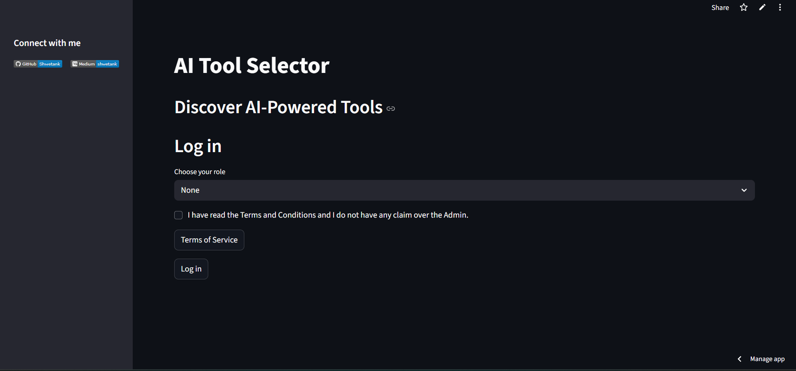
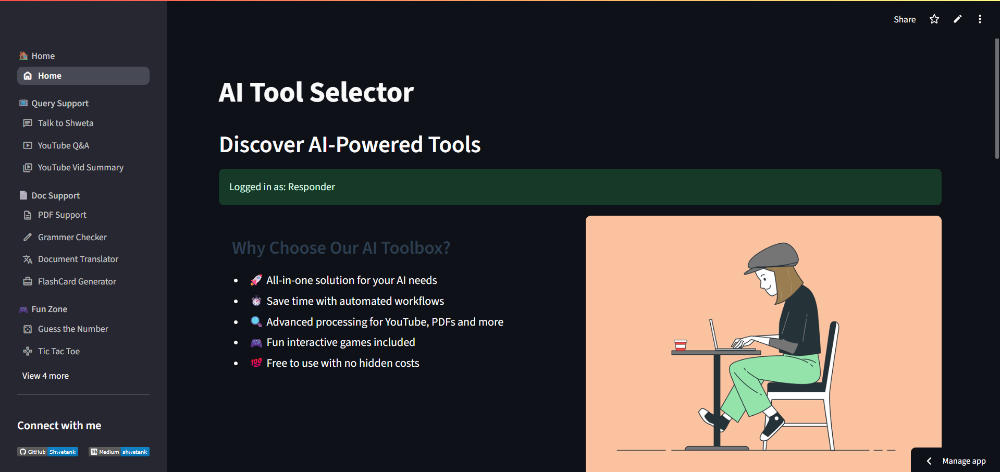

# 🔥 AI Tool Hub - Your Intelligent Productivity Suite

<div align="center">
  
</div>

[](LICENSE)
[](https://ai-tool-kit-by-chatak-shweta.streamlit.app/)


A comprehensive collection of AI-powered tools for content processing, learning enhancement, and productivity optimization.

## ✨ Core Features

### 🧠 AI Processing Tools
- **YouTube Intelligence**: Q&A generation and video summarization
- **Document AI**: PDF analysis, grammar enhancement, and translation
- **Flashcard Generator**: Instant study material creation

### ⚡ Productivity Boosters
- **Smart Assistant**: "Talk to Shweta" AI helper
- **Code Tools**: Working on it
- **Writing Assistant**: Working on it

### 🎮 Learning & Entertainment
- **Interactive Games**: Brain-boosting mini-games
- **Knowledge Challenges**: Quiz generators

---

## 🚀 Quick Start

### 🌐 Live Deployment
➡️ **[Access Live App](https://ai-tool-kit-by-chatak-shweta.streamlit.app/)**

🔒 *  Dummy Login required to access all features*

### Home page ->
<div align="center">
  
</div>
 
### 📥 Local Installation
```bash
# Clone repository
git clone https://github.com/yourusername/ai-tool-hub.git

# Navigate to project directory
cd ai-tool-hub

# Install dependencies
pip install -r requirements.txt

# Launch application
streamlit run app.py

```

## 📬 Contact Us

<div align="center" style="margin: 40px 0;">

### ✉️ **Email-**
 [Shwetank Maurya](mailto:sd3564086@gmail.com)  

---

### 🌐 **Connect With Me**
<p style="margin: 30px 0;">
  <a href="https://github.com/Shwetank-Maurya" style="margin: 0 10px;">
    
  </a>
  <a href="https://medium.com/@shwetank_maurya" style="margin: 0 10px;">
    
  </a>
  
</p>

---
